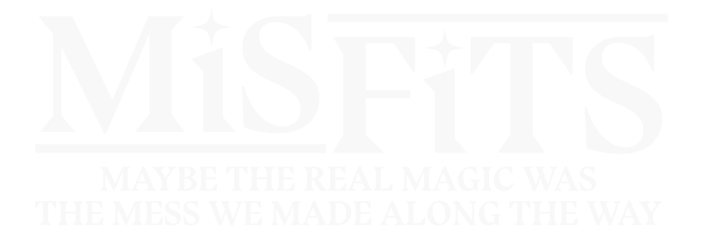

Misfits is a TTRPG by Sam Thiel

Version: Alpha-Obsidian 4.5.8

The content in this webpage, and the pages linked to it, are part of the Misfits TTRPG.
Copyright: Sam Thiel © 2026 

## **Introduction**

You are one of the many young people displaced by the Drain who have fallen through the cracks of the social, legal, and educational systems in Panops.
You are also a mage that can create any effect you may need with enough time, mana, and creativity. 
...so you're going to do something about all that. 

*Misfits* is played with a set of five 6-sided dice. When you take actions, you’ll be asked to roll these five dice. Additionally, you will pick two *aspects*, which will determine the numbers you’re looking to roll when you take actions. Along with your two core aspects, you will pick a *drive* and an *origin*. These three things together will determine the way you play, as well as your character’s personality and background.   
Maybe you’re a demigod revolutionist who relies on luck and raw strength to power through their opponents. Maybe you’re an insightful ley whose willpower and preparation gets them around most obstacles. Maybe you’re a frog. Maybe not. Ask your GM if you want to be a frog. That's not on me. 

## **On this website:**

This website is a series of linked subpages of my (Sam Thiel's) personal site. These subpages are uploaded from an Obsidian notebook using the Enveloppe community plugin. These pages are adapted from a single Google Doc (which was over 100 pages long before conversion), and so the terms "document" and "book" may appear in these webpages—they refer to the collection of webpages. 

The Misfits rules are posted here for easy access for my playtesters. The rules of Misfits posted here are a living document, and are the early stages of an eventual book and dedicated webpage for this game. They are also intended to be accessed primarily by my playtesters for the sake of playtesting the game. 

If you've made it here from my other work, or through GitHub or some other method, feel free to poke around, but if you'd like to become a playtester I ask that you send me an email before simply taking these documents and running with them—the documents here are likely not fully updated. 

## **On This Rulebook**:

This rulebook is a living document. Rules will change frequently, and the final version of this rulebook likely won't be finished for some time. The version number at the top of this page indicates the date this rulebook was last updated with the last two digits (the first number is for my own record keeping). 

There are some notational conventions which hold throughout these pages:

The first is that a term in [brackets] is a nonexistent crosslink. This means it either refers to content on the same page, or content on a webpage that has not been linked yet. As this rulebooks is fleshed out more of these will be covered and built in as links. 

The other is that a comment in {braces} is a comment from me, Sam, specifically. It should be interpreted as a meta-element and not part of the fundamental rules and the world they inhabit. Often these are either explanatory notes, jokes, or very fast summaries of sections that I'm yet to write. 

## Table of Contents

You can find the Table of Contents in the top right corner of this page, or [Here]().

